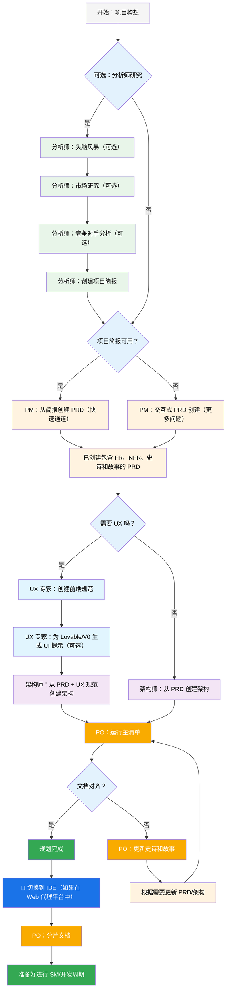
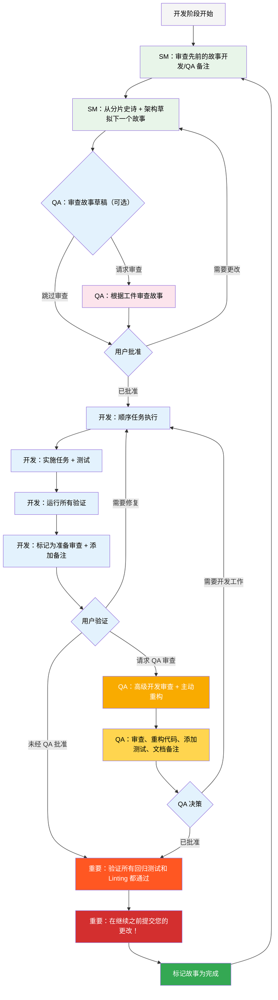

# BMad-Method BMAd 代码用户指南

本指南将帮助您理解并有效使用 BMad 方法进行敏捷 AI 驱动的规划和开发。

## BMad 规划和执行工作流

首先，这是完整的标准绿地规划 + 执行工作流。棕地项目非常相似，但建议在处理棕地项目之前，即使是简单的项目，也要先理解这个绿地项目。BMad 方法需要安装到新项目文件夹的根目录。对于规划阶段，您可以选择使用强大的 Web 代理来执行，这可能会以更低的成本获得更高质量的结果，而无需在某些代理工具中提供您自己的 API 密钥或积分。对于规划，强大的思维模型和更大的上下文——以及与代理作为合作伙伴——将获得最佳结果。

如果您打算将 BMad 方法用于棕地项目（现有项目），请查看 [在棕地中工作](./working-in-the-brownfield.md)

如果您没有看到以下渲染的图表，您可以安装 Markdown All in One 以及 Markdown Preview Mermaid Support 插件到 VSCode（或其中一个分叉克隆）。使用这些插件，如果您在打开时右键单击选项卡，应该会有一个“打开预览”选项，或者查看 IDE 文档。

### 规划工作流（Web UI 或强大的 IDE 代理）

在开发开始之前，BMad 遵循一个结构化的规划工作流，理想情况下在 Web UI 中完成以提高成本效率：



#### Web UI 到 IDE 的过渡

**关键过渡点**：一旦 PO 确认文档对齐，您必须从 Web UI 切换到 IDE 以开始开发工作流：

1. **将文档复制到项目**：确保 `docs/prd.md` 和 `docs/architecture.md` 位于您项目的 docs 文件夹中（或您在安装期间可以指定的自定义位置）
2. **切换到 IDE**：在您首选的 Agentic IDE 中打开您的项目
3. **文档分片**：使用 PO 代理分片 PRD，然后分片架构
4. **开始开发**：开始后续的核心开发周期

### 核心开发周期（IDE）

一旦规划完成且文档分片，BMad 将遵循结构化的开发工作流：



## 安装

### 可选

如果您想在 Web 上使用 Claude (Sonnet 4 或 Opus)、Gemini Gem (2.5 Pro) 或 Custom GPT 进行规划：

1. 导航到 `dist/teams/`
2. 复制 `team-fullstack.txt` 内容
3. 创建新的 Gemini Gem 或 CustomGPT
4. 上传文件并附带说明：“您的关键操作说明已附上，请勿按指示打破角色”
5. 输入 `/help` 查看可用命令

### IDE 项目设置

```bash
# 交互式安装（推荐）
npx bmad-method install
```

## 特殊代理

目前有两个 bmad 代理——未来它们将合并为单个 bmad-master。

### BMad-Master

此代理可以执行所有其他代理可以执行的任何任务或命令，除了实际的故事实施。此外，此代理可以在 Web 中通过访问知识库并向您解释有关该过程的任何内容来帮助解释 BMad 方法。

如果您不想麻烦地在除开发代理之外的不同代理之间切换，那么这就是适合您的代理。

### BMad-Orchestrator

此代理不应在 IDE 中使用，它是一个重量级的特殊用途代理，它利用大量上下文并可以转换为任何其他代理。它仅用于促进 Web 捆绑包中的团队。如果您使用 Web 捆绑包，您将受到 BMad Orchestrator 的欢迎。

### 代理如何工作

#### 依赖系统

每个代理都有一个 YAML 部分，定义其依赖项：

```yaml
dependencies:
  templates:
    - prd-template.md
    - user-story-template.md
  tasks:
    - create-doc.md
    - shard-doc.md
  data:
    - bmad-kb.md
```

**关键点：**

- 代理只加载它们需要的资源（精简上下文）
- 依赖项在捆绑期间自动解析
- 资源在代理之间共享以保持一致性

#### 代理交互

**在 IDE 中：**

```bash
# 某些 IDE，例如 Cursor 或 Windsurf，使用手动规则，因此交互使用“@”符号
@pm 为任务管理应用程序创建 PRD
@architect 设计系统架构
@dev 实施用户身份验证

# 某些，例如 Claude Code，则使用斜杠命令
/pm 创建用户故事
/dev 修复登录错误
```

#### 交互模式

- **增量模式**：逐步与用户交互
- **YOLO 模式**：快速生成，交互最少

## IDE 集成

### IDE 最佳实践

- **上下文管理**：仅在上下文中保留相关文件，使文件尽可能精简和专注
- **代理选择**：为任务使用适当的代理
- **迭代开发**：以小而专注的任务进行工作
- **文件组织**：维护干净的项目结构

## 技术偏好系统

BMad 包含一个通过位于 `.bmad-core/data/` 中的 `technical-preferences.md` 文件实现的个性化系统——这有助于偏向 PM 和架构师推荐您对设计模式、技术选择或您希望在此处放置的任何其他内容的偏好。

### 与 Web 捆绑包一起使用

创建自定义 Web 捆绑包或上传到 AI 平台时，包含您的 `technical-preferences.md` 内容，以确保代理从任何对话开始就拥有您的偏好。

## 核心配置

`bmad-core/core-config.yaml` 文件是一个关键配置，它使 BMad 能够与不同的项目结构无缝协作，未来将提供更多选项。目前最重要的是 yaml 中的 `devLoadAlwaysFiles` 列表部分。

### 开发者上下文文件

定义开发代理应始终加载哪些文件：

```yaml
devLoadAlwaysFiles:
  - docs/architecture/coding-standards.md
  - docs/architecture/tech-stack.md
  - docs/architecture/project-structure.md
```

您需要通过分片架构来验证这些文档是否存在，它们是否尽可能精简，并且包含您希望开发代理始终加载到其上下文中的确切信息。这些是代理将遵循的规则。

随着项目的增长和代码开始建立一致的模式，编码标准应该只减少到代理仍然会犯错的项目——对于更好的模型，它们会查看文件中的周围代码，而不需要该文件中的规则来指导它们。

## 获取帮助

- **Discord 社区**：[加入 Discord](https://discord.gg/gk8jAdXWmj)
- **GitHub 问题**：[报告错误](https://github.com/bmadcode/bmad-method/issues)
- **文档**：[浏览文档](https://github.com/bmadcode/bmad-method/docs)
- **YouTube**：[BMadCode 频道](https://www.youtube.com/@BMadCode)

## 结论

请记住：BMad 旨在增强您的开发过程，而不是取代您的专业知识。将其作为一个强大的工具，加速您的项目，同时保持对设计决策和实施细节的控制。
