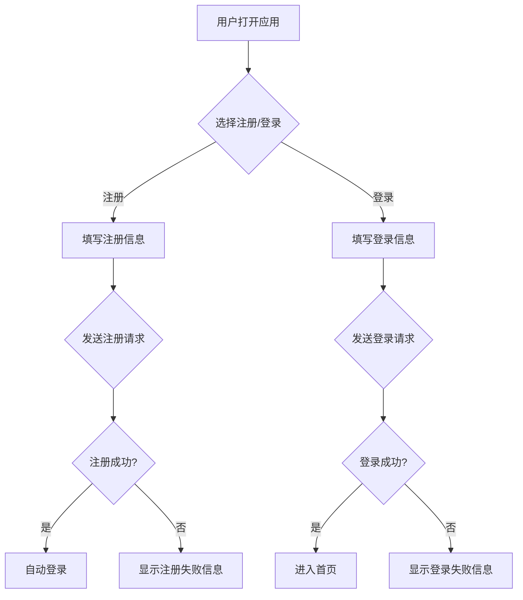
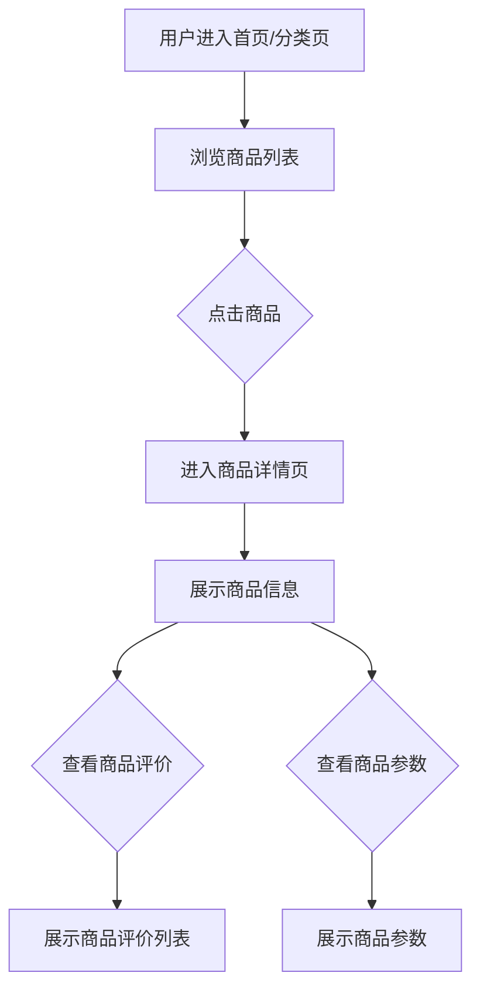
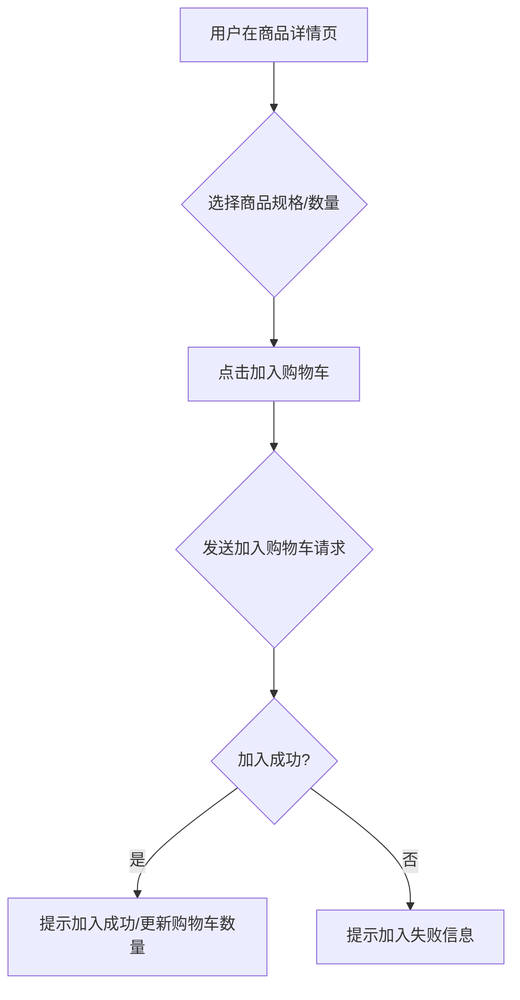
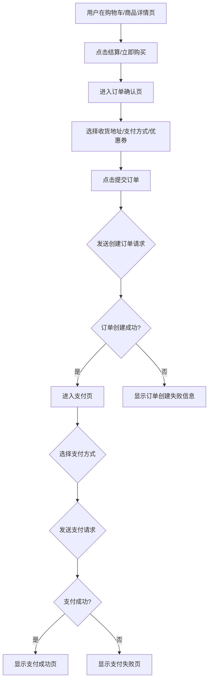
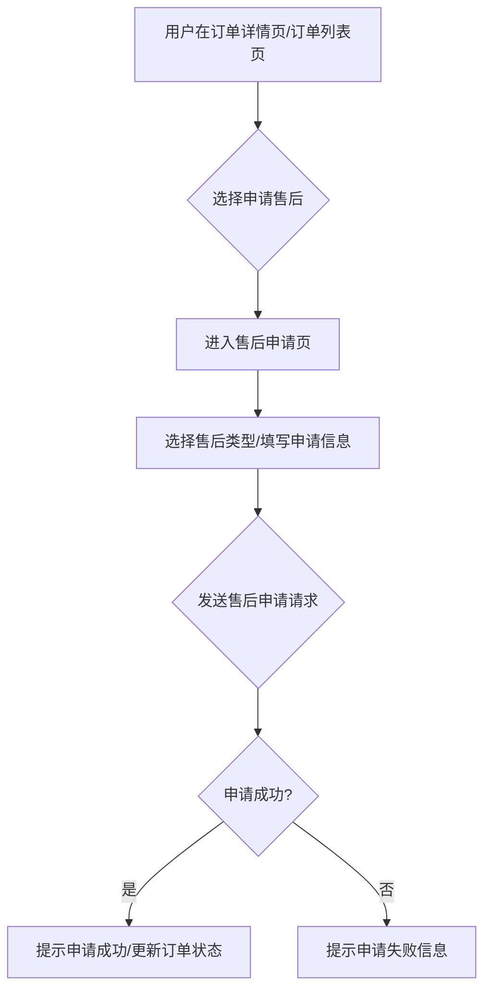

## 业务流程 - docs/project_biz_workflow.md

### 1. 用户注册/登录流程

#### 核心流程图

#### 调用链路

**注册流程**:

1.  `userMRegister()`: 用户注册。
2.  `verificationSmsGet()`: 获取短信验证码。
3.  `verificationSmsCheck()`: 校验短信验证码。

**登录流程**:

1.  `userMLogin()`: 手机号码登录。
2.  `userMLoginMobile()`: 手机号码和验证码登录。
3.  `verificationSmsGet()`: 获取短信验证码。
4.  `verificationSmsCheck()`: 校验短信验证码。

#### 关键判断点

| 判断点       | 条件                   | 处理路径     |
| ------------ | ---------------------- | ------------ |
| 注册信息校验 | 手机号、密码格式不正确 | 提示错误信息 |
| 验证码校验   | 验证码错误或过期       | 提示错误信息 |
| 登录凭证校验 | 用户名或密码错误       | 提示错误信息 |

### 2. 商品浏览/详情流程

#### 核心流程图

#### 调用链路

1.  `goodsList()`: 获取商品列表。
2.  `goodsDetail()`: 获取商品详情。
3.  `goodsReputation()`: 获取商品评价列表。
4.  `goodsVisitLogAdd()`: 添加商品浏览足迹。

#### 关键判断点

| 判断点       | 条件                 | 处理路径         |
| ------------ | -------------------- | ---------------- |
| 商品数据加载 | 商品不存在或加载失败 | 显示错误或空状态 |

### 3. 加入购物车流程

#### 核心流程图

#### 调用链路

1.  `shoppingCartAdd()`: 加入购物车。
2.  `shoppingCartInfo()`: 获取购物车信息（用于更新购物车数量）。

#### 关键判断点

| 判断点       | 条件           | 处理路径         |
| ------------ | -------------- | ---------------- |
| 商品库存校验 | 库存不足       | 提示库存不足     |
| 商品规格校验 | 规格选择不完整 | 提示选择完整规格 |

### 4. 订单创建/支付流程

#### 核心流程图

#### 调用链路

1.  `orderCreate()`: 创建订单。
2.  `userShoppingAddressList()`: 获取收货地址列表。
3.  `userShoppingAddressDefault()`: 获取默认收货地址。
4.  `discountsMy()`: 获取我的优惠券。
5.  `orderPay()`: 钱包支付订单。

#### 关键判断点

| 判断点       | 条件                       | 处理路径     |
| ------------ | -------------------------- | ------------ |
| 订单创建校验 | 商品信息、收货地址等不完整 | 提示错误信息 |
| 支付结果校验 | 支付失败                   | 提示支付失败 |

### 5. 订单售后流程

#### 核心流程图

#### 调用链路

1.  `orderRefundApplyApply()`: 申请售后。
2.  `orderRefundApplyInfo()`: 获取退换货详情。
3.  `orderRefundApplyCancel()`: 撤销退换货申请。

#### 关键判断点

| 判断点       | 条件                       | 处理路径         |
| ------------ | -------------------------- | ---------------- |
| 售后申请校验 | 申请信息不完整或不符合规则 | 提示错误信息     |
| 售后状态更新 | 售后申请成功               | 更新订单售后状态 |
